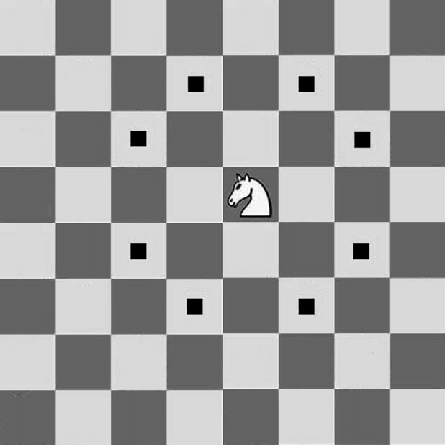

## Placing Knights
In this problem, we are required to find the maximum number of knights we can place on a chessboard so that no two knights threaten each other. In order to solve this problem, we need to make a simple - but fundamental - observation on its nature. Let's have a look at the chessboard.



We soon realize that a knight can only attack (or be attacked) by knights that are positioned in cells of the opposite color! Indeed, the set of possible positions in bipartite (black cells on the left, white cells on the right, no edges between cells of the same color) and we can solve it as a Maximum Indipendent Set problem. To code it, it might be useful to start from [this](https://algolab.inf.ethz.ch/doc/tutorials/sample_code/tut09_bgl-residual_bfs.cpp) provided example, as the BFS
on the residual graph is already implemented.

**Pitfalls**
- must be careful with indices; to check the color of a cell remember to use the comparison `(i+j)%2`
- remember to check if a cell if it's in the chessboard or not!


### Results
```
   Test set 1 (30 pts / 0.500 s) : Correct answer      (0.0s)
   Test set 2 (35 pts / 0.500 s) : Correct answer      (0.044s)
   Test set 3 (35 pts / 0.500 s) : Correct answer      (0.132s)
```

